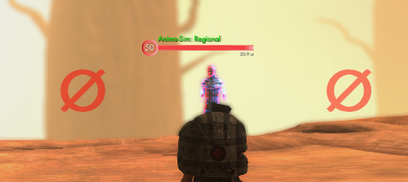
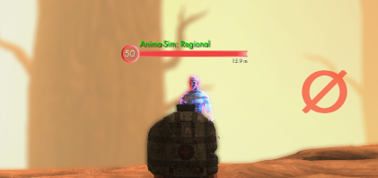

# Rangefinder
SWL addon displaying whether main-hand or off-hand weapon abilities are in range. Main-hand weapon indicator is shown on the left side of the reticle, off-hand weapon indicator is shown on the right side of the reticle.

If an enemy-targeted ability is equipped, this addon will show a red indicator when the target is out of that weapon's range. 

Note that it doesn't work with ground-targeted or player-based AoE abilities or abilities that have a nonstandard range. If a valid ability isn't equipped for one weapon, that indicator is hidden.

## Screenshots 
Both weapons out of range:

 

Off-hand weapon out of range:

 

## Customization
The spacing and size of the indicators can be adjusted with the following commands:

horizontal offset: `/setoption rf_hoffset #` (default 150)

size: `/setoption rf_fontsize #` (default 60)

## List of Abilities
These are the abilities the addon uses to determine ranges:

### Assault Rifle
- Placed Shot
- Full Auto
- Burst Fire
- Incendiary Grenade
- Essence Grenades
- Red Mist
- Unveil Essence
- High Explosive Grenade
### Blade
- Flowing Strike
- Tsunami
- Swallow Cut
- Snake's Bite
### Blood
- Torment
- Reap
- Maleficium
- Runic Hex
- Rupture
- Desecrate
- Eldritch Scourge
### Chaos
- Deconstruct
- Breakdown
- Distortion
### Elemental
- Ice Beam
- Fire Bolt
- Fireball
- Shock
- Chain Lightning
- Mjolnir
### Fist
- Thrash
- Mangle
- Eviscerate
- Berserk
- Ravage
- Maim
### Hammer
- Blindside
- Pulverize
- Smash
- Demolish
### Pistol
- Hair Trigger
- Seeking Bullet
- Controlled Shooting
- Dual Shot
- Unload
- Kill Blind
- All In
- Trick Shot
### Shotgun
- Pump Action
- Rocket Pod
- Raging Shot
- HEAT Round
